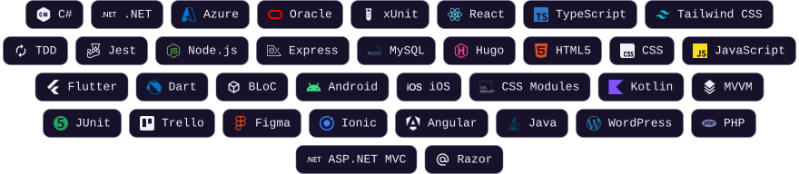
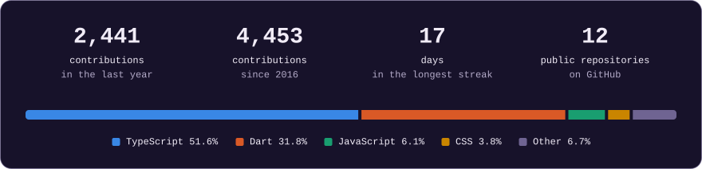

<!-- Written by the sync of this repository from the content of the portfolio. Do not edit it by hand: see docs/SYNC.md. -->

<a href="https://www.mreysei.dev/en">
<picture>
  <source media="(prefers-color-scheme: dark)" srcset="assets/banner-dark.svg">
  <source media="(prefers-color-scheme: light)" srcset="assets/banner-light.svg">
  
</picture>
</a>

<picture>
  <source media="(prefers-color-scheme: dark)" srcset="https://www.mreysei.dev/api/github-profile/views.svg?theme=dark&amp;locale=en">
  <source media="(prefers-color-scheme: light)" srcset="https://www.mreysei.dev/api/github-profile/views.svg?theme=light&amp;locale=en">
  
</picture>

## About

Lead Frontend Specialist &amp; Consultant · Japan

Michael Reyes is a **Lead Frontend Specialist & Consultant** at Lean Mind, a consultancy specialised in *TDD, best practices and agile methodologies* for quality software development. With **more than 10 years** of experience in the field, he specialises in *Next.js, Node.js and TypeScript*, and has worked on projects of very different kinds: from mobile applications with *Flutter* to international e-invoicing solutions with *C# and .NET*. He works remotely from Tenerife with national and international teams.

His work rests on **three pillars**: *rigorous technical development, team mentoring and the promotion of a quality culture*. He applies best practices, agile methodologies and testing in all his projects, and as a consultant he has supported teams of up to **fourteen people** in adopting sustainable quality standards. He shares his experience in technical articles on the blog and programming exercises in the katas section. Beyond software, he is passionate about *design and Japanese culture*.

## Latest posts

- **[Code is not everything](https://www.mreysei.dev/en/blog/code-is-not-everything)** 
  In this article, I reflect on the importance of people before code itself. 
  Jan 28, 2025 · 4 min read
- **[Feedback is necessary](https://www.mreysei.dev/en/blog/feedback-is-necessary)** 
  During a trip I took a few months ago, I spent a lot of time thinking about myself, especially in relation to work because... 
  Dec 16, 2022 · 2 min read
- **[Devs Lives #17 \| A developer travelling to Japan](https://www.mreysei.dev/en/blog/devs-lives-17-developer-travelling-to-japan)** 
  Some time ago I lived in Japan for about four months while studying Japanese. When I came back... 
  Aug 15, 2022 · 65 min to read and watch
- **[Hooks in Flutter](https://www.mreysei.dev/en/blog/hooks-in-flutter)** 
  Did you know that Flutter has Hooks too? In this video I explain how they work by comparing them with React Hooks. 
  May 24, 2021 · 13 min to read and watch
- **[Understanding the Flutter BLoC Pattern](https://www.mreysei.dev/en/blog/understanding-the-flutter-bloc-pattern)** 
  In this article, I will explain how Flutter’s BLoC Pattern works. 
  Jun 19, 2020 · 5 min read

[Every post on the blog](https://www.mreysei.dev/en/blog) →

## Projects

- **[¡Decídete!](https://www.mreysei.dev/en/projects/decidete)** Mobile app · 2026 
  Decide between two options based on the preferences and importance you choose.

## Career

| When | What | Where |
| --- | --- | --- |
| Jul 2018 – Present | Lead Frontend Specialist &amp; Consultant | [Lean Mind](https://leanmind.es/) |
| Dec 2017 – Apr 2018 | Web Developer | Omnia Infosys |
| Mar 2017 – Dec 2017 | Full-Stack Developer · Internship | Bakata Solutions |
| Sep 2015 – Jun 2017 | Higher Diploma in Web Application Development (DAW) | CIFP César Manrique |
| Jan 2014 – Aug 2015 | Freelance Web Developer | mreysei |

## Stack

<picture>
  <source media="(prefers-color-scheme: dark)" srcset="assets/stack-dark.svg">
  <source media="(prefers-color-scheme: light)" srcset="assets/stack-light.svg">
  
</picture>

## GitHub in numbers

<picture>
  <source media="(prefers-color-scheme: dark)" srcset="assets/activity-dark.svg">
  <source media="(prefers-color-scheme: light)" srcset="assets/activity-light.svg">
  
</picture>

---

Written from the content of <a href="https://www.mreysei.dev/en">www.mreysei.dev</a> by a workflow of this repository.

